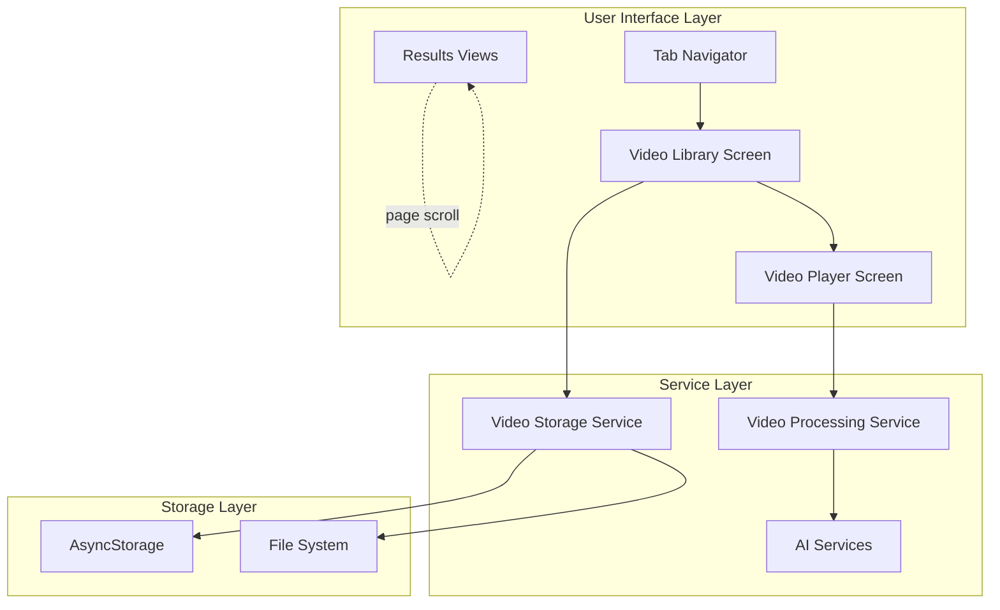

# Design Document: Video Library and UI Improvements

## Overview

This design extends the Arabic Video Translator (AVT) PWA with video library management capabilities and improves the UI scrolling experience. The feature enables users to select videos from their device's file system, store them in a persistent library, play videos within the app, and process them for transcription. Additionally, it removes element-level scrolling from result views in favor of page-level scrolling for a more natural reading experience.

### Key Components

- **Video Selection**: Integration with device file picker (iOS Files app on iPhone, native file picker on web)
- **Video Library**: Persistent storage and display of imported videos with metadata
- **Video Playback**: In-app video player with standard controls and processing integration
- **UI Scrolling Improvements**: Removal of element-level scrolling containers in favor of page-level scrolling
- **Navigation Integration**: New library screen accessible from tab navigation

### Technology Stack

- **React Native**: Cross-platform UI framework (with react-native-web for PWA)
- **Expo**: Development platform providing native module access
- **expo-document-picker**: File selection from device storage
- **expo-av**: Video playback capabilities
- **AsyncStorage**: Persistent storage for video metadata
- **React Navigation**: Screen navigation and routing

## Architecture

### High-Level Architecture



### Component Hierarchy

```
App
└── SafeAreaProvider
    └── AppNavigator
        └── TabNavigator
            ├── StackNavigator (Home Tab)
            │   ├── SplashScreen
            │   ├── UploadScreen
            │   ├── ConfigureScreen
            │   ├── ProcessingScreen
            │   └── ResultsScreen
            ├── VideoLibraryNavigator (Library Tab) [NEW]
            │   ├── VideoLibraryScreen [NEW]
            │   └── VideoPlayerScreen [NEW]
            └── HistoryScreen (History Tab)
```

### Data Flow

1. **Video Import Flow**:
   - User taps "Select Videos" button
   - expo-document-picker opens native file picker
   - User selects video file(s)
   - Video metadata extracted (filename, duration, URI)
   - Metadata persisted to AsyncStorage
   - Thumbnail generated and cached
   - Library UI updates to display new video

2. **Video Playback Flow**:
   - User taps video in library
   - Navigate to VideoPlayerScreen with video URI
   - expo-av Video component loads and plays video
   - User can control playback or initiate processing

3. **Video Processing Flow**:
   - User taps "Process Video" in player
   - Navigate to ConfigureScreen with video URI
   - Follows existing processing workflow
   - Results displayed in ResultsScreen with improved scrolling

4. **Scrolling Improvement Flow**:
   - Results views render content without ScrollView wrapper
   - Content flows naturally with page-level scroll
   - RTL text direction maintained for Arabic content

## Components and Interfaces

### New Components

#### VideoLibraryScreen

**Purpose**: Display all imported videos in a browsable grid/list interface

**Props**: None (uses navigation and storage service)

**State**:
```javascript
{
  videos: Array<VideoMetadata>,
  loading: boolean,
  error: string | null
}
```

**Key Methods**:
- `loadVideos()`: Load video metadata from AsyncStorage
- `handleVideoSelect(videoId)`: Navigate to player screen
- `handleVideoDelete(videoId)`: Remove video from library
- `handleImportVideos()`: Open file picker and import new videos

**UI Elements**:
- Header with "Import Videos" button
- Grid/List of video cards
- Empty state when no videos
- Loading indicator
- Error message display

#### VideoPlayerScreen

**Purpose**: Play selected video with controls and processing option

**Props**:
```javascript
{
  route: {
    params: {
      videoId: string,
      videoUri: string,
      videoName: string
    }
  },
  navigation: NavigationProp
}
```

**State**:
```javascript
{
  isPlaying: boolean,
  position: number,
  duration: number,
  isFullscreen: boolean,
  error: string | null
}
```

**Key Methods**:
- `handlePlayPause()`: Toggle playback
- `handleSeek(position)`: Seek to position
- `handleFullscreen()`: Toggle fullscreen mode
- `handleProcessVideo()`: Navigate to processing workflow
- `handleBackToLibrary()`: Return to library

**UI Elements**:
- Video player component
- Playback controls (play/pause, seek bar, time display)
- Fullscreen toggle
- "Process Video" button
- Back navigation

#### VideoCard Component

**Purpose**: Display individual video in library grid

**Props**:
```javascript
{
  video: VideoMetadata,
  onPress: (videoId) => void,
  onDelete: (videoId) => void
}
```

**UI Elements**:
- Thumbnail image
- Video filename
- Duration badge
- Delete button (icon)

### Modified Components

#### TabNavigator

**Changes**:
- Add "Library" tab alongside "Home" and "History"
- Route to VideoLibraryNavigator for library tab
- Update tab bar to show 3 tabs

#### ResultsScreen Views (TranscriptView, TranslationView, DuaView)

**Changes**:
- Remove ScrollView wrapper from content
- Remove `maxHeight` and `overflow` styles
- Allow content to flow with page-level scroll
- Maintain RTL text direction for Arabic
- Preserve copy-to-clipboard functionality
- Keep liquid glass design aesthetic

### Services

#### VideoStorageService

**Location**: `src/services/videoStorageService.js`

**Purpose**: Manage persistent storage of video metadata

**Interface**:
```javascript
// Save video metadata
async function saveVideo(videoMetadata: VideoMetadata): Promise<void>

// Get all videos
async function getAllVideos(): Promise<Array<VideoMetadata>>

// Get single video by ID
async function getVideo(videoId: string): Promise<VideoMetadata | null>

// Delete video
async function deleteVideo(videoId: string): Promise<void>

// Clear all videos
async function clearAllVideos(): Promise<void>
```

**VideoMetadata Type**:
```javascript
{
  id: string,           // Unique identifier
  uri: string,          // File system URI
  filename: string,     // Original filename
  duration: number,     // Duration in seconds
  thumbnailUri: string, // Thumbnail image URI
  dateAdded: number,    // Timestamp
  size: number          // File size in bytes
}
```

**Storage Key**: `@avt_video_library`

**Implementation Notes**:
- Uses AsyncStorage for metadata persistence
- Video files remain in device file system
- Handles URI validation and accessibility checks
- Implements error handling for storage failures

#### VideoPickerService

**Location**: `src/services/videoPickerService.js`

**Purpose**: Handle video file selection from device

**Interface**:
```javascript
// Pick single video
async function pickVideo(): Promise<VideoFile | null>

// Pick multiple videos
async function pickMultipleVideos(): Promise<Array<VideoFile>>

// Validate video file
function isValidVideoFile(file: VideoFile): boolean

// Extract video metadata
async function extractVideoMetadata(uri: string): Promise<VideoMetadata>
```

**VideoFile Type**:
```javascript
{
  uri: string,
  name: string,
  size: number,
  mimeType: string
}
```

**Supported Formats**: MP4, MOV, M4V

**Implementation Notes**:
- Uses expo-document-picker for file selection
- Validates file type and size
- Extracts duration using expo-av
- Generates thumbnail from first frame
- Handles permission errors gracefully

## Data Models

### VideoMetadata

Represents a video stored in the library.

```javascript
{
  id: string,           // UUID v4
  uri: string,          // file:// or content:// URI
  filename: string,     // Display name
  duration: number,     // Seconds (float)
  thumbnailUri: string, // Local cache URI
  dateAdded: number,    // Unix timestamp (ms)
  size: number,         // Bytes
  format: string        // 'mp4' | 'mov' | 'm4v'
}
```

### VideoLibraryState

Represents the persisted library state in AsyncStorage.

```javascript
{
  videos: Array<VideoMetadata>,
  version: number,      // Schema version for migrations
  lastModified: number  // Unix timestamp (ms)
}
```

### Navigation Parameters

#### VideoPlayerScreen Route Params

```javascript
{
  videoId: string,
  videoUri: string,
  videoName: string,
  duration: number
}
```

#### ConfigureScreen Route Params (Extended)

```javascript
{
  videoUri: string,      // Existing or from library
  source: 'upload' | 'library'  // Track source for analytics
}
```

## Correctness Properties

*A property is a characteristic or behavior that should hold true across all valid executions of a system-essentially, a formal statement about what the system should do. Properties serve as the bridge between human-readable specifications and machine-verifiable correctness guarantees.*


### Property 1: Video Import Storage

*For any* valid video file(s) selected through the file picker, importing them should result in those videos being stored and accessible within the AVT application.

**Validates: Requirements 1.3**

### Property 2: Video Format Support

*For any* video file in a supported format (MP4, MOV, M4V), the Video_Selector should accept and successfully import the file.

**Validates: Requirements 1.4**

### Property 3: Unsupported Format Rejection

*For any* file in an unsupported video format, the Video_Selector should reject the import and display an appropriate error message.

**Validates: Requirements 1.5**

### Property 4: Library Display Completeness

*For any* video successfully imported, that video should appear in the Video_Library display.

**Validates: Requirements 1.6, 2.1**

### Property 5: Video Metadata Display

*For any* video displayed in the library, the UI should show all required metadata: thumbnail preview, filename, and duration.

**Validates: Requirements 2.2, 2.3, 2.4**

### Property 6: Video Selection Navigation

*For any* video in the library that is tapped, the application should navigate to the video playback interface.

**Validates: Requirements 2.5, 3.1**

### Property 7: Video Persistence Round-Trip

*For any* video imported into the library, closing and reopening the application should result in that video still being available in the library with all its metadata intact.

**Validates: Requirements 2.6, 9.1, 9.3, 9.4**

### Property 8: Video Removal

*For any* video in the library that is deleted, that video should no longer appear in the library display or storage.

**Validates: Requirements 2.7**

### Property 9: Playback Time Display Accuracy

*For any* video being played, the displayed current playback time and total duration should accurately reflect the video's actual playback state.

**Validates: Requirements 3.3**

### Property 10: Playback Error Handling

*For any* video playback failure, the Video_Player should display an error message that includes information about the failure reason.

**Validates: Requirements 3.7**

### Property 11: Page-Level Scrolling for Long Content

*For any* result view (Transcript, Translation, or Dua) with content exceeding the viewport height, the page-level scroll should allow the user to scroll through the entire content without element-level scroll containers.

**Validates: Requirements 4.3, 5.5**

### Property 12: RTL Text Direction Preservation

*For any* Arabic text content displayed in the Transcript_View, the text direction should be right-to-left (RTL).

**Validates: Requirements 4.4**

### Property 13: Consistent Scrolling Behavior

*For any* result view (Transcript, Translation, Dua), the scrolling behavior should be consistent - all using page-level scrolling without element-level scroll containers.

**Validates: Requirements 5.6**

### Property 14: Dua Format Validation

*For any* dua extracted by the Dua_Service, the output should be formatted in the three-line format: Arabic text, phonetic transliteration, and Dutch meaning.

**Validates: Requirements 6.6**

### Property 15: Navigation Stack Preservation

*For any* navigation action between screens (including tab switches), the navigation stack should be maintained correctly, allowing proper back navigation.

**Validates: Requirements 8.5**

### Property 16: Video File Accessibility Error Handling

*For any* stored video whose file is no longer accessible on the device, the Video_Library should display an error indicator for that video rather than crashing or showing incorrect information.

**Validates: Requirements 9.5**

### Property 17: Library Clear Operation

*For any* video library state, executing the clear operation should result in an empty library with no videos displayed or stored.

**Validates: Requirements 9.6**

### Property 18: Processing Navigation

*For any* video in the Video_Player where the user initiates processing, the application should navigate to the processing screen with the video URI.

**Validates: Requirements 10.2**

### Property 19: Processing Workflow Equivalence

*For any* video, whether processed from the upload workflow or the library workflow, the transcription and translation results should be functionally equivalent (same AI services, same processing steps).

**Validates: Requirements 10.4**

### Property 20: Processing Completion Display

*For any* video processing that completes successfully, the application should navigate to and display the results in the Results screen.

**Validates: Requirements 10.5**

## Error Handling

### Video Selection Errors

**Scenario**: User selects unsupported file format
- **Detection**: File MIME type validation in VideoPickerService
- **Response**: Display toast/alert with message "Unsupported file format. Please select MP4, MOV, or M4V files."
- **Recovery**: Allow user to select different file

**Scenario**: File picker permission denied
- **Detection**: expo-document-picker throws permission error
- **Response**: Display alert explaining permission requirement with option to open settings
- **Recovery**: User can grant permission and retry

**Scenario**: File too large or corrupted
- **Detection**: File size check or metadata extraction failure
- **Response**: Display error message with specific issue
- **Recovery**: User can select different file

### Video Storage Errors

**Scenario**: AsyncStorage quota exceeded
- **Detection**: AsyncStorage.setItem throws quota error
- **Response**: Display message "Storage full. Please remove some videos from library."
- **Recovery**: User can delete videos to free space

**Scenario**: Storage read/write failure
- **Detection**: AsyncStorage operations throw errors
- **Response**: Display generic error message and log error details
- **Recovery**: Retry operation or restart app

**Scenario**: Corrupted storage data
- **Detection**: JSON parse error when reading library state
- **Response**: Log error, clear corrupted data, initialize empty library
- **Recovery**: User can re-import videos

### Video Playback Errors

**Scenario**: Video file no longer accessible
- **Detection**: expo-av Video component onError callback
- **Response**: Display error message "Video file not found or no longer accessible"
- **Recovery**: Return to library, show error indicator on video card

**Scenario**: Unsupported codec or corrupted video
- **Detection**: expo-av playback error
- **Response**: Display error message "Unable to play video. File may be corrupted."
- **Recovery**: User can try different video or re-import

**Scenario**: Network error (if streaming)
- **Detection**: expo-av network error
- **Response**: Display error message "Network error. Please check connection."
- **Recovery**: Retry playback when connection restored

### Processing Integration Errors

**Scenario**: Video URI invalid when starting processing
- **Detection**: URI validation before navigation
- **Response**: Display error message "Invalid video. Please try again."
- **Recovery**: Return to library

**Scenario**: Processing fails for library video
- **Detection**: Processing service error callbacks
- **Response**: Display error in ProcessingScreen (existing error handling)
- **Recovery**: User can retry or return to library

### UI Scrolling Errors

**Scenario**: Content doesn't scroll on long results
- **Detection**: Manual testing and user reports
- **Response**: Verify ScrollView is not wrapping content
- **Recovery**: Code fix to remove ScrollView wrapper

**Scenario**: RTL text direction not applied
- **Detection**: Visual inspection of Arabic text
- **Response**: Verify textAlign and direction styles
- **Recovery**: Code fix to apply RTL styles

### Error Logging Strategy

All errors should be logged with:
- Timestamp
- Error type/category
- Error message
- Stack trace (if available)
- User action that triggered error
- Device/platform information

For production, consider integrating error tracking service (e.g., Sentry) for remote error monitoring.

## Testing Strategy

### Dual Testing Approach

This feature will use both unit testing and property-based testing to ensure comprehensive coverage:

- **Unit tests**: Verify specific examples, edge cases, error conditions, and UI component rendering
- **Property tests**: Verify universal properties across all inputs using randomized test data

Both approaches are complementary and necessary for comprehensive coverage. Unit tests catch concrete bugs and validate specific scenarios, while property tests verify general correctness across a wide range of inputs.

### Property-Based Testing

**Library**: fast-check (JavaScript property-based testing library)

**Configuration**: Each property test will run a minimum of 100 iterations to ensure thorough coverage through randomization.

**Test Tagging**: Each property test will include a comment tag referencing the design document property:
```javascript
// Feature: video-library-and-ui-improvements, Property 1: Video Import Storage
```

**Property Test Examples**:

1. **Property 1: Video Import Storage**
   - Generate: Random valid video metadata
   - Action: Import video
   - Assert: Video is stored and retrievable

2. **Property 7: Video Persistence Round-Trip**
   - Generate: Random set of video metadata
   - Action: Store videos, simulate app restart, load videos
   - Assert: All videos retrieved with identical metadata

3. **Property 11: Page-Level Scrolling for Long Content**
   - Generate: Random long text content
   - Action: Render in result view
   - Assert: No ScrollView wrapper present, content flows with page

4. **Property 14: Dua Format Validation**
   - Generate: Random Arabic text with duas
   - Action: Extract duas
   - Assert: Each dua has exactly 3 lines (Arabic, transliteration, Dutch)

### Unit Testing

**Framework**: Jest (React Native default)

**Test Categories**:

1. **Component Tests**:
   - VideoLibraryScreen renders correctly
   - VideoPlayerScreen controls work
   - VideoCard displays metadata
   - Empty state displays when no videos
   - Error states display correctly

2. **Service Tests**:
   - VideoStorageService CRUD operations
   - VideoPickerService file validation
   - Format validation for MP4, MOV, M4V
   - Error handling for unsupported formats

3. **Integration Tests**:
   - Video import flow end-to-end
   - Video playback to processing flow
   - Navigation between screens
   - AsyncStorage persistence

4. **Edge Cases**:
   - Empty library state
   - Single video in library
   - Large number of videos (performance)
   - Very long video filenames
   - Missing video files
   - Corrupted storage data

5. **Scrolling Tests**:
   - Transcript view has no ScrollView wrapper
   - Translation view has no ScrollView wrapper
   - Dua view has no ScrollView wrapper
   - RTL direction applied to Arabic text
   - Copy-to-clipboard still works

### Test Coverage Goals

- **Line Coverage**: Minimum 80%
- **Branch Coverage**: Minimum 75%
- **Function Coverage**: Minimum 85%

### Manual Testing Checklist

Due to the PWA nature and device-specific features, manual testing is required for:

1. **iOS Files App Integration**:
   - File picker opens correctly on iPhone
   - Video selection works
   - Multiple video selection works
   - Permission handling

2. **Video Playback**:
   - Videos play smoothly
   - Controls are responsive
   - Fullscreen mode works
   - Seek functionality accurate

3. **UI/UX**:
   - Scrolling feels natural on all result views
   - RTL text displays correctly
   - Liquid glass aesthetic maintained
   - Responsive design on different screen sizes

4. **Performance**:
   - Library loads quickly with many videos
   - Thumbnail generation doesn't block UI
   - Video playback is smooth
   - No memory leaks with repeated imports

5. **Cross-Platform**:
   - Works on iOS Safari (PWA)
   - Works on desktop browsers
   - File picker appropriate for each platform

### Continuous Integration

Tests should run automatically on:
- Every commit to feature branch
- Pull request creation
- Merge to main branch

CI pipeline should:
1. Run all unit tests
2. Run all property tests
3. Generate coverage report
4. Fail build if coverage below thresholds
5. Run linting and type checking

### Security Testing

**Video File Validation**:
- Test with malicious file extensions
- Test with files claiming to be videos but aren't
- Test with extremely large files
- Test with files containing special characters in names

**Storage Security**:
- Verify video URIs are properly sanitized
- Test for injection attacks in filenames
- Verify AsyncStorage data is properly scoped to app

### Accessibility Testing

- Screen reader compatibility for video library
- Keyboard navigation for video controls
- Sufficient color contrast for all UI elements
- Touch target sizes meet minimum requirements (44x44 points)

## Deployment Considerations

### Vercel Configuration

The existing `vercel.json` is already configured correctly:
```json
{
  "buildCommand": "npm run build",
  "outputDirectory": "dist",
  "framework": "vite"
}
```

The build command runs `expo export --platform web` which generates the static PWA files in the `dist` directory.

### Build Process

1. **Pre-build**: Expo prebuild generates native project files (if needed)
2. **Export**: `expo export --platform web` creates optimized web bundle
3. **Post-export**: `scripts/postexport.cjs` runs to finalize build artifacts
4. **Deploy**: Vercel deploys the `dist` directory

### Environment Variables

Required environment variables for deployment:
- None currently required for video library feature (uses local storage only)
- AI services use Pollinations AI (no API key required)

### PWA Manifest Updates

The `web/manifest.json` should be updated to reflect new capabilities:
```json
{
  "name": "Arabic Video Translator",
  "short_name": "AVT",
  "description": "Transcribe, translate, and extract duas from Arabic videos",
  "start_url": "/",
  "display": "standalone",
  "background_color": "#0a0a0a",
  "theme_color": "#1a1a2e",
  "icons": [...]
}
```

### Service Worker Considerations

The existing `web/sw.js` service worker should cache:
- Video thumbnails (with size limits)
- App shell resources
- Static assets

Video files themselves should NOT be cached due to size constraints.

### Performance Optimization

1. **Lazy Loading**: Video thumbnails loaded on-demand
2. **Pagination**: If library grows large, implement virtual scrolling
3. **Thumbnail Size**: Limit thumbnail resolution to reduce storage
4. **Debouncing**: Debounce search/filter operations in library
5. **Code Splitting**: Lazy load video player screen

### Browser Compatibility

**Minimum Requirements**:
- iOS Safari 14+ (for PWA features)
- Chrome 90+
- Firefox 88+
- Edge 90+

**Feature Detection**:
- Check for File API support
- Check for Video API support
- Graceful degradation if features unavailable

### Storage Limits

**AsyncStorage Limits**:
- iOS: ~10MB typical limit
- Web: Varies by browser (5-10MB typical)

**Mitigation**:
- Store only metadata, not video files
- Limit thumbnail sizes
- Implement storage quota monitoring
- Provide clear library functionality

### Monitoring and Analytics

Consider tracking:
- Number of videos in library (distribution)
- Video import success/failure rates
- Playback errors by video format
- Processing completion rates from library vs upload
- Scrolling behavior on results screens

## Migration Strategy

### Existing Users

For users upgrading to this version:

1. **No Breaking Changes**: Existing upload workflow remains unchanged
2. **New Tab**: Library tab appears in navigation
3. **Empty State**: Library starts empty, users can import videos
4. **Scrolling**: Results screens automatically use new scrolling behavior

### Data Migration

No data migration required as this is a new feature. Existing history and results are unaffected.

### Rollback Plan

If issues arise:
1. Remove Library tab from navigation
2. Revert scrolling changes to result views
3. Deploy previous version
4. Investigate and fix issues
5. Redeploy with fixes

### Feature Flags

Consider implementing feature flags for:
- Video library feature (can disable if issues found)
- New scrolling behavior (can revert to old behavior)
- Video processing from library (can disable integration)

This allows gradual rollout and quick rollback if needed.

## Future Enhancements

Potential future improvements not in current scope:

1. **Video Editing**: Trim videos before processing
2. **Batch Processing**: Process multiple videos at once
3. **Cloud Sync**: Sync library across devices
4. **Video Sharing**: Share videos with other users
5. **Playlists**: Organize videos into collections
6. **Search/Filter**: Search videos by name or date
7. **Video Recording**: Record videos directly in app
8. **Subtitle Export**: Export transcriptions as SRT files
9. **Video Annotations**: Add notes/timestamps to videos
10. **Advanced Analytics**: Track processing history per video

These enhancements can be considered for future iterations based on user feedback and usage patterns.
